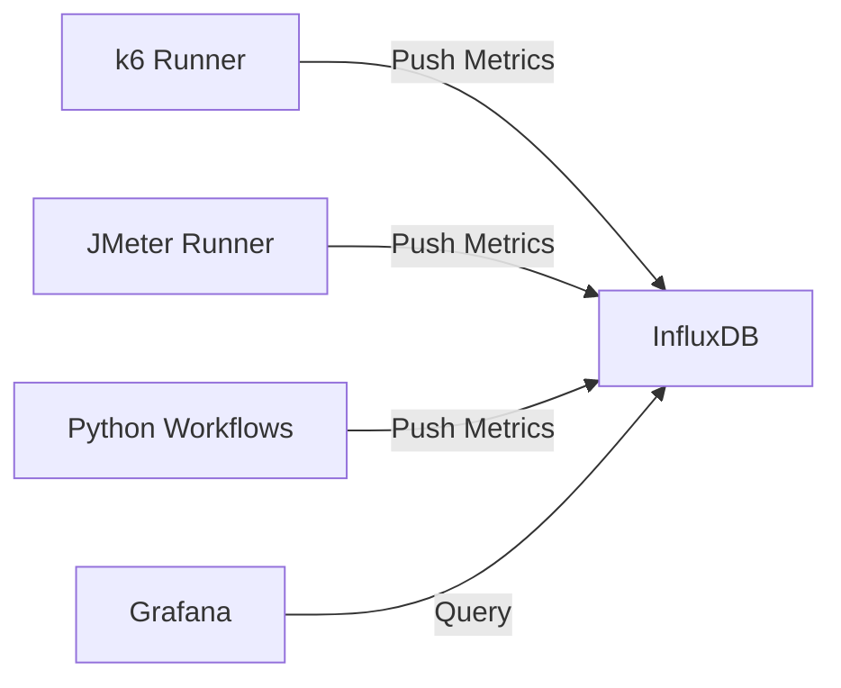

# Real-Time Monitoring with InfluxDB & Grafana

The APT framework includes a fully integrated real-time monitoring stack using **InfluxDB** and **Grafana**. This allows you to visualize performance metrics live as your tests run, rather than waiting for a post-execution HTML report.

## 🚀 Quick Start

1. **Start the Monitoring Stack:**
   ```bash
   docker-compose up -d
   ```
   This spins up:
   *   **InfluxDB** (Port 8086): Time-series database for metrics.
   *   **Grafana** (Port 3000): Dashboard visualization.

2. **Run a Test:**
   Set the `INFLUXDB_URL` environment variable to enable real-time reporting.
   ```bash
   export INFLUXDB_URL="http://localhost:8086"
   pytest examples/unified_performance_test.yml
   ```

3. **View Dashboard:**
   *   Open **[http://localhost:3000](http://localhost:3000)**.
   *   Login: `admin` / `admin`.
   *   The **InfluxDB** datasource is automatically provisioned.
   *   You can create dashboards or import standard k6 dashboards (e.g., ID `2587`).

---

## 📊 How It Works

### Architecture
The framework uses a "Push" architecture where test runners send metrics directly to InfluxDB.



### 1. k6 Integration
We use the native k6 InfluxDB output. When `INFLUXDB_URL` is detected, the runner automatically appends:
`--out influxdb=http://localhost:8086/k6`

**Metrics Captured:**
*   `http_req_duration`: Latency (avg, p90, p95, max).
*   `http_reqs`: Throughput (RPS).
*   `vus`: Virtual Users count.

### 2. Python Workflow Integration
Custom workflow steps (API calls defined in YAML or Python) report directly using our `InfluxDBPublisher`.

**Metric Name:** `workflow_step`
**Tags:**
*   `step`: Name of the step (e.g., `login`).
*   `workflow`: Name of the parent workflow.
*   `status`: `success` or `failure`.

**Fields:**
*   `duration`: Execution time in seconds.
*   `success_count`: 1 or 0.

### 3. Grafana Auto-Provisioning
We use Grafana's `provisioning` system to pre-configure the connection.
*   File: `docker/grafana/provisioning/datasources/influxdb.yml`
*   This means you **never** have to manually add the data source. It's ready the moment the container starts.

---

## 🛠️ Configuration

The stack is configured via `docker-compose.yml` and environment variables.

| Variable | Default | Description |
| :--- | :--- | :--- |
| `INFLUXDB_URL` | `None` | Set to enabling reporting (e.g., `http://localhost:8086`). |
| `INFLUXDB_DB` | `k6` | The database name to write metrics to. |

### Data Persistence
*   **InfluxDB Data:** Persisted in `influxdb-data` Docker volume.
*   **Grafana Data:** Persisted in `grafana-data` Docker volume.

To reset data completely:
```bash
docker-compose down -v
```
